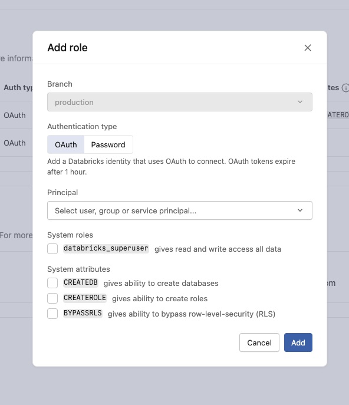
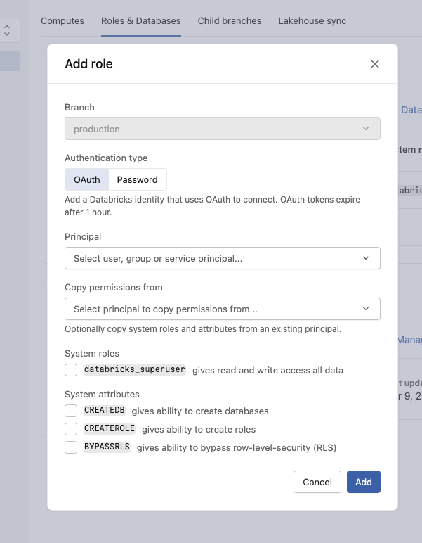

# Lakebase "Add Role" — Copy Permissions From

**Date:** 2026-03-12
**Status:** Discussion starter
**Audience:** Lakebase product team
**Tracking:** [LKB-7729](https://databricks.atlassian.net/browse/LKB-7729)

## The problem

When building [Databricks Apps](https://docs.databricks.com/aws/en/dev-tools/databricks-apps/) with Lakebase, two PostgreSQL roles are involved: the developer's **OAuth role** (local development) and the app's **Service Principal role** (each Databricks App runs under its own Service Principal that connects to Lakebase on behalf of the app). Granting `databricks_superuser` via the Lakebase UI solves most DML access cases, but DDL ownership remains role-scoped — a role cannot run CREATE SCHEMA or CREATE TABLE on schemas owned by another role. This creates friction in three scenarios:

### Deploy first, then develop locally

The Service Principal creates schemas and tables on deploy (becoming their owner). A developer with `databricks_superuser` can read/write data but cannot run DDL on those schemas.

### Develop locally first, then deploy

The developer creates schemas and tables locally under their OAuth role. When the app is deployed, the Service Principal cannot access those objects. The developer would need to copy their permissions to the Service Principal.

### Onboarding new developers

Each new developer needs the same access profile as an existing principal (typically the project owner or the Service Principal). Today this requires manually selecting the right system roles and attributes — there's no way to express "same permissions as that person".

## Current workaround

In AppKit, we guide users to deploy the app first so the Service Principal initializes the schema, then develop locally for data operations only. The app template ensures DDL is skipped if objects already exist (see [Database Permissions](https://github.com/databricks/appkit/blob/ecae1a8c157f7f95290dfb4af36976076219bc13/docs/docs/plugins/lakebase.md#database-permissions)). This works for the "deploy first" scenario but does not address the "develop locally first" or "onboarding new developers" cases.

## Suggestion: add "Copy permissions from" to the Add role UI

Add an optional **"Copy permissions from"** dropdown to the existing "Add role" dialog. When a source principal is selected, the new role inherits the same system roles and attributes.

**Current UI:**

**Suggested UI (with "Copy permissions from"):**

**Why this helps:**

- Covers the most common onboarding case in one step — "same access as the Service Principal" or "same access as the project owner"
- No new concepts - extends the existing Add role flow
- Reduces misconfiguration risk