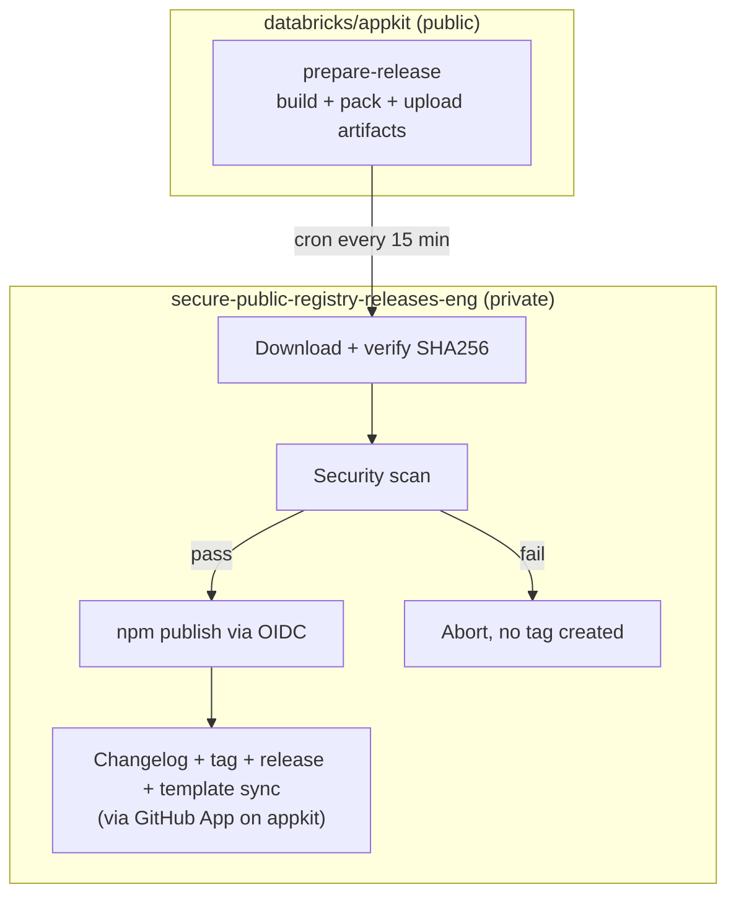
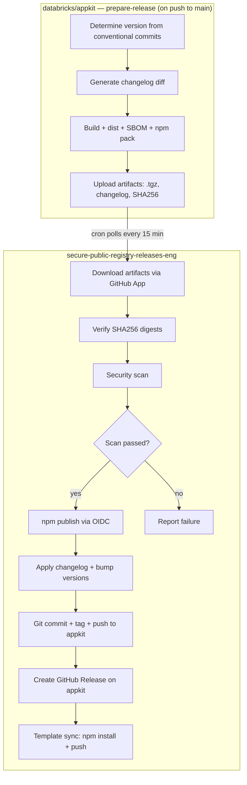

# Secure AppKit Releases

## Problem Frame

Databricks security policy requires all npm publishing to happen from `databricks/secure-public-registry-releases-eng` — a private repository with hardened runners, OIDC Trusted Publishing, and mandatory artifact scanning. Currently, AppKit publishes directly from the public `databricks/appkit` repo. We need to move npm publishing while preserving automation and keeping as much workflow logic in appkit as possible.

Packages affected:

- `@databricks/appkit`, `@databricks/appkit-ui` (released together)
- `@databricks/lakebase` (independent)

## Related Resources

- [ESI-4424 — GitHub Platform Change Review](https://databricks.atlassian.net/browse/ESI-4424)
- [How to publish to 3rd party registries](https://docs.google.com/document/d/1D8jgOG1zHLtQByUme68kiogHYpffXDlnhZvxpB04TbA)
- [NPM Release SOP](https://docs.google.com/document/d/1tHJY79T-dc4rLa6xSFd1ML7f3wQl_InqW3kKzrM13vY)

## Release Flow

### High-Level Diagram

### Detailed Flow

**Step 1 — `databricks/appkit` (public):** `prepare-release` workflow (automatic on push to `main`):

1. Determine next version from conventional commits
2. Generate changelog diff
3. Sync versions across packages + build + dist + SBOM + npm pack
4. Upload artifacts: `.tgz` files, changelog diff, version, SHA256 digests
5. **No commit, no tag, no push** — only build and upload

⬇️ *secure repo cron polls for new successful runs every 15 min*

**Step 2 — `secure-public-registry-releases-eng` (private):** Cron workflow:

1. GitHub App (`actions: read`) → list successful `prepare-release` runs on appkit
2. For each unprocessed run (check if tag `v{version}` exists → skip if yes):
   a. Download `.tgz` artifacts via GitHub REST API
   b. Verify SHA256 digests (artifact integrity, per ESI-4424)
   c. Security scan (`databricks/gh-action-scan`)
   d. If pass → npm publish via OIDC (`npm-oidc-publish.sh`)
   e. Via GitHub App (`contents: write`) on appkit:
      - Apply changelog diff to `CHANGELOG.md`
      - Bump versions in `package.json` files + build `NOTICE.md`
      - Git commit + tag `v{version}` + push to `main`
      - Create published GitHub Release
   f. Template sync: checkout fresh appkit `main`, `npm install` (public npm), commit + tag `template-v{version}`, push via GitHub App

## Reliability Guarantees

- **Source of truth**: Git tag on appkit. Tag exists = fully processed. No tag = needs processing (retry).
- **Idempotent pipeline**: If publish succeeds but git push fails, next cron retry will:
  - Re-scan (same artifacts, passes again)
  - npm publish returns 403 "already exists" → treated as success
  - Git push succeeds → tag created → done
- **Ordering**: Cron processes runs oldest-first to preserve changelog continuity.
- **Changelog continuity**: `conventional-changelog` always diffs from the latest tag, so each `prepare-release` generates the correct diff regardless of timing.
- **Multiple queued releases**: Processed sequentially. Each successful run creates a tag, so the next release's changelog is based on the correct baseline.

## Requirements

### Appkit: `prepare-release` Workflow

- **R1.** Must trigger automatically on push to `main` (merge of PRs with conventional commits)
- **R2.** Must determine version from conventional commits without committing or tagging
- **R3.** Must generate changelog diff as a downloadable artifact
- **R4.** Must sync versions across packages, build, create dist packages, generate SBOMs, and run `npm pack`
- **R5.** Must upload `.tgz` files, changelog diff, version number, and SHA256 digests as workflow artifacts
- **R6.** Must NOT commit, tag, push, or create any GitHub Release
- **R7.** Must include actor authorization check (admin/maintain role per SOP)

### Secure Repo Workflow

- **R8.** A cron workflow (every 15 minutes) must poll `databricks/appkit` for successful `prepare-release` runs using a GitHub App token (`actions: read`)
- **R9.** Must check if tag `v{version}` (or `lakebase-v{version}`) already exists on appkit — skip if yes (idempotent)
- **R10.** Must distinguish release streams by version artifact: appkit+appkit-ui vs lakebase
- **R11.** Must download `.tgz` artifacts via GitHub REST API and verify SHA256 digests before scanning (per ESI-4424)
- **R12.** Must scan artifacts using `databricks/gh-action-scan` before publishing
- **R13.** Must publish via npm OIDC Trusted Publishing using `npm-oidc-publish.sh` (per PR #18 / SOP)
- **R14.** After publish, must apply changelog, bump versions, commit, tag, and push to appkit `main` via GitHub App (`contents: write`)
- **R15.** Must create a published GitHub Release on appkit via GitHub App
- **R16.** After release, must run template sync: checkout fresh appkit `main`, `npm install` (public npm — JFrog proxy has 7-day propagation delay), commit + tag `template-v{version}`, push via GitHub App
- **R17.** Must handle npm 403 "already exists" as success (idempotent retry)
- **R18.** Must include actor authorization check (admin/maintain role per SOP)
- **R19.** Must support `workflow_dispatch` with manual run ID input as fallback

### GitHub App

- **R20.** A GitHub App must be created with `contents: write` and `actions: read` permissions on `databricks/appkit`
- **R21.** `actions: write` is NOT required — no workflow triggering needed (secure repo does all git ops directly)
- **R22.** The App's private key and ID must be stored only in the secure repo (private key as secret, app ID as variable)
- **R23.** The App must be added to the branch protection bypass list on appkit's `main` branch (`GITHUB_TOKEN` cannot push to protected branches)
- **R24.** The App must be used for: listing workflow runs, downloading artifacts, pushing commits/tags, creating releases, and template sync pushes

### npm Trusted Publisher Configuration

- **R25.** Each package must have Trusted Publisher configured on npmjs.com pointing to the secure repo's workflow
- **R26.** Environments must be created in the secure repo: `npm-@databricks/appkit`, `npm-@databricks/appkit-ui`, `npm-@databricks/lakebase`

### Secure Repo Structure (per SOP)

- **R27.** CODEOWNERS must be updated with entries for the workflow and artifacts directory (using `@databricks/eng-apps-devex` team)
- **R28.** Artifacts directories must be created: `artifacts/appkit/`
- **R29.** All GitHub Actions must use SHA-pinned references (conftest policy compliance)

### Security (per ESI-4424)

- **R30.** Artifact integrity must be verified via SHA256 digests before publish
- **R31.** Audit logging must be enabled for GitHub App activity, workflow runs, and package publishing
- **R32.** Rollback and incident response procedures must be documented for compromised credentials or incorrect releases
- **R33.** Per-workflow environments must be enforced — each team's workflow can only access its own environment

### Supply Chain Protection for Template Sync

- **R34.** All dependencies in `template/package.json` must use exact versions (no `^`, `~`, `>=`, `*` prefixes)
- **R35.** A CI lint step on appkit must validate pinned deps on PRs touching `template/package.json`
- **R36.** During template sync in the secure repo, a lockfile diff check must verify that only `@databricks/appkit` and `@databricks/appkit-ui` changed — abort if unexpected packages are modified

### Fallback: Manual Mode

- **R37.** The secure repo must support `workflow_dispatch` with appkit run ID as input (no cron needed)
- **R38.** In manual mode, the secure repo performs the full pipeline: download → verify → scan → publish → changelog → tag → release → template sync
- **R39.** The transition from manual to automated mode should require only enabling the cron schedule

## Success Criteria

- npm packages are published from the secure repo with OIDC Trusted Publishing (no stored npm tokens)
- All artifacts are security-scanned and SHA256-verified before publication
- The full release pipeline (build → scan → publish → changelog → tag → template sync) is automated with ≤15 min delay
- No orphaned tags or changelog entries: git artifacts only created after successful publish
- Existing `pnpm release:dry` continues to work for local previews (version calculation)
- Lakebase releases work independently with the same pipeline
- Pipeline is idempotent and self-healing on partial failures

## Scope Boundaries

- **Not changing:** CI workflows (lint, test, typecheck), dev workflow, package structure
- **Not changing:** How conventional commits determine version bumps
- **Not changing:** Changelog generation format or content
- **Not in scope:** Migrating other Databricks npm packages (only appkit, appkit-ui, lakebase)
- **Not in scope:** Creating the GitHub App itself (infra team responsibility, we document requirements)
- **Not in scope:** Configuring Trusted Publishers on npmjs.com (manual step, documented)

## Key Decisions

- **Tag-after pattern:** No git tag or release created until scan + publish succeed. Prevents orphaned tags and changelog entries.
- **Workflow artifacts as signal:** `prepare-release` uploads artifacts; secure repo polls for new successful runs. No draft releases needed.
- **No finalize-release workflow on appkit:** `GITHUB_TOKEN` cannot push to protected `main` branch. The secure repo does all post-publish git operations directly via GitHub App token (which bypasses branch protection).
- **Template sync in secure repo:** JFrog proxy has 7-day propagation delay for new packages, so template sync must run where public npm is immediately reachable.
- **GitHub App: `contents: write` + `actions: read` only:** No `actions: write` needed — secure repo doesn't trigger workflows, it does everything directly via REST API.
- **Follow PR #18 pattern:** Use `npm-oidc-publish.sh` for OIDC token exchange (works on self-hosted runners, proven in CI).
- **Supply chain protection:** CI lint for pinned deps (prevent) + lockfile diff check in secure repo (detect).

### Alternative considered: Full pipeline in secure repo

The entire release pipeline (including `prepare-release`) could run in the secure repo. **Pros:** single orchestration point. **Cons:** harder to maintain — build config lives in appkit but executes remotely, debugging requires private repo access, `pnpm release:dry` disconnected from reality.

## Dependencies / Assumptions

- `npm-oidc-publish.sh` script exists in the secure repo (PR #18 branch; worst case we fork from that branch)
- `databricks/gh-action-scan` action works for npm `.tgz` artifacts
- Infra team will create GitHub environments for Trusted Publishing when requested
- Infra team will approve CODEOWNERS changes and GitHub App installation

## Outstanding Questions

### Resolve Before Planning

- [Affects R20-R24][Infra team] Does the secure repo already have a GitHub App for cross-repo operations, or does one need to be created? Who should own it?

### Deferred to Planning

- [Affects R8][Technical] How to handle multiple queued prepare-release runs (process oldest first, verified by tag check)
- [Affects R13][Needs research] Whether `npm-oidc-publish.sh` handles multiple packages in one workflow run or needs separate publish jobs per package/environment
- [Affects R37-R39][Technical] Exact conditional logic for manual vs automated mode

## Next Steps

→ Resolve the GitHub App question with the infra team, then proceed to implementation planning
