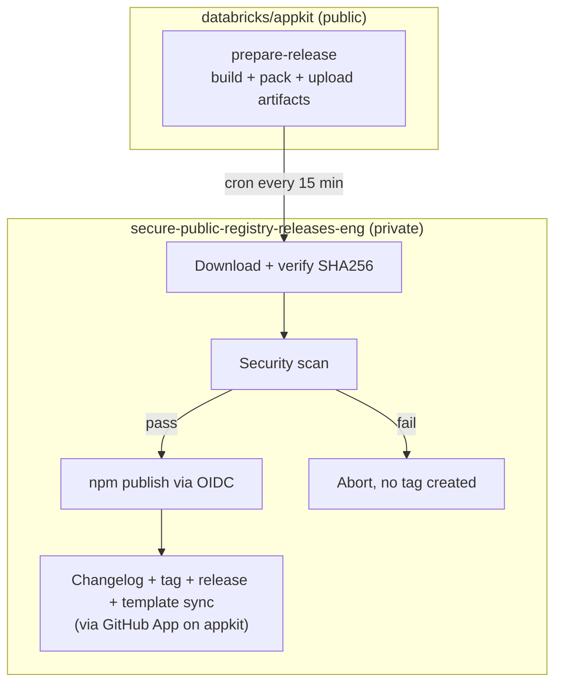
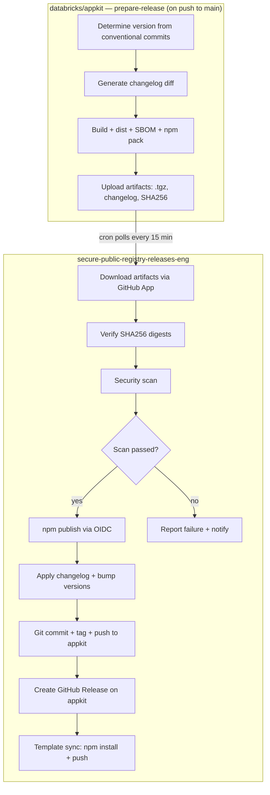

# Secure AppKit Releases

## Problem Frame

Databricks security policy requires all npm publishing to happen from `databricks/secure-public-registry-releases-eng` — a private repository with hardened runners, OIDC Trusted Publishing, and mandatory artifact scanning. Currently, AppKit publishes directly from the public `databricks/appkit` repo. We need to move npm publishing while preserving automation and keeping as much workflow logic in appkit as possible.

Packages affected:

- `@databricks/appkit`, `@databricks/appkit-ui` (released together)
- `@databricks/lakebase` (independent)

## Related Resources

- [ESI-4424 — GitHub Platform Change Review](https://databricks.atlassian.net/browse/ESI-4424)
- [How to publish to 3rd party registries](https://docs.google.com/document/d/1D8jgOG1zHLtQByUme68kiogHYpffXDlnhZvxpB04TbA)
- [NPM Release SOP](https://docs.google.com/document/d/1tHJY79T-dc4rLa6xSFd1ML7f3wQl_InqW3kKzrM13vY)

## Release Flow

### High-Level Diagram

### Detailed Flow

**Step 1 — `databricks/appkit` (public):** `prepare-release` workflow (automatic on push to `main`):

1. Determine next version from conventional commits
2. Generate changelog diff
3. Sync versions across packages + build + dist + SBOM + npm pack
4. Upload artifacts: `.tgz` files, changelog diff, version, SHA256 digests
5. **No commit, no tag, no push** — only build and upload

*secure repo cron polls for new successful runs every 15 min*

**Step 2 — `secure-public-registry-releases-eng` (private):** Cron workflow:

1. GitHub App (`actions: read`) → list successful `prepare-release` runs on appkit
2. For each unprocessed run (check if tag `v{version}` exists → skip if yes):
   a. Download `.tgz` artifacts via GitHub REST API
   b. Verify SHA256 digests (artifact integrity, per ESI-4424) — fail-closed
   c. Security scan (`databricks/gh-action-scan`)
   d. If pass → npm publish via OIDC (`npm-oidc-publish.sh`)
   e. Via GitHub App (`contents: write`) on appkit:
      - Apply changelog diff to `CHANGELOG.md`
      - Bump versions in `package.json` files + build `NOTICE.md`
      - Git commit + tag `v{version}` + push to `main`
      - Create published GitHub Release
   f. Template sync: checkout fresh appkit `main`, `npm install` (public npm), commit + tag `template-v{version}`, push via GitHub App

For commit ordering, race condition prevention, and reliability guarantees, see [implementation plan](./2026-04-03-centralize-release-plan.md).

## Requirements

### Appkit: `prepare-release` Workflow

- **R1.** Must trigger on push to `main`. Must use `concurrency: { group: prepare-release, cancel-in-progress: true }` to ensure only the latest run survives. Must exit early if no releasable commits since last tag.
- **R2.** Must determine version from conventional commits without committing or tagging
- **R3.** Must generate changelog diff as a downloadable artifact
- **R4.** Must sync versions across packages, build, create dist packages, generate SBOMs, and run `npm pack`
- **R5.** Must upload `.tgz` files, changelog diff, version number, and SHA256 digests as workflow artifacts with `retention-days: 7`. Artifact names must include the run number (e.g., `appkit-release-{run_number}`) to handle upload-artifact v4 immutability.
- **R6.** Must NOT commit, tag, push, or create any GitHub Release
- **R7.** Workflow artifacts must use explicit retention (`retention-days: 7`) and run-scoped names to handle upload-artifact v4 immutability constraints

### Secure Repo Workflow

- **R8.** A cron workflow (every 15 minutes) must poll `databricks/appkit` for successful `prepare-release` runs using a GitHub App token (`actions: read`)
- **R9.** Must check if tag `v{version}` (or `lakebase-v{version}`) already exists on appkit — skip if yes (idempotent)
- **R10.** Must distinguish release streams by workflow name: `prepare-release` produces appkit+appkit-ui artifacts, `prepare-release-lakebase` produces lakebase artifacts. The secure repo identifies the stream from the source workflow name in the run metadata.
- **R11.** Must download `.tgz` artifacts via GitHub REST API and verify SHA256 digests before scanning (per ESI-4424). Verification must be fail-closed — if any digest mismatch or verification error occurs, the pipeline must abort. No `continue-on-error`, conditional bypass, or manual override path may skip this step.
- **R12.** Must scan artifacts using `databricks/gh-action-scan` before publishing
- **R13.** Must publish via npm OIDC Trusted Publishing using `npm-oidc-publish.sh` (per PR #18 / SOP). Publish jobs require `id-token: write` permission for OIDC token fetch.
- **R14.** After publish, must apply changelog, bump versions, commit, tag, and push to appkit `main` via GitHub App (`contents: write`)
- **R15.** Must create a published GitHub Release on appkit via GitHub App
- **R16.** After release, must run template sync: checkout fresh appkit `main`, `npm install` (public npm — JFrog proxy has 7-day propagation delay), commit + tag `template-v{version}`, push via GitHub App
- **R17.** Must handle npm 403 "already exists" as success (idempotent retry)
- **R18.** Pipeline failures (scan failure, publish failure, finalize failure) must produce a notification (GitHub Actions failure notification or Slack webhook) so failures are not silent
- **R19.** Must support `workflow_dispatch` with manual run ID input as fallback

### Actor Authorization

- **R20.** Both `prepare-release` (appkit) and the secure repo workflow must include an actor authorization check verifying the triggering actor has admin or maintain role on the repository (per SOP). For scheduled/cron triggers, this check applies to the `workflow_dispatch` manual fallback path only.

### GitHub App

- **R21.** A GitHub App must be created with `contents: write` and `actions: read` permissions on `databricks/appkit`. Note: `actions: write` is NOT required — the secure repo does all git operations directly via REST API, no workflow triggering needed.
- **R22.** The App's private key and ID must be stored only in the secure repo (private key as encrypted secret, app ID as variable). The private key must be rotated at least annually (≤365 days) with the rotation schedule documented in the secure repo's README or runbook.
- **R23.** The App must be added to the branch protection bypass list on appkit's `main` branch (`GITHUB_TOKEN` cannot push to protected branches)
- **R24.** Branch protection on appkit's `main` must require PR review from a non-author reviewer and passing CI status checks. The GitHub App's `contents: write` permission makes an unprotected branch a direct supply chain risk.
- **R25.** The App must be used for: listing workflow runs, downloading artifacts, pushing commits/tags, creating releases, and template sync pushes
- **R26.** The GitHub App must be installed with repository-level scope limited to `databricks/appkit` only — not org-wide or across additional repositories.

### npm Trusted Publisher Configuration

- **R27.** Each package must have Trusted Publisher configured on npmjs.com pointing to the secure repo's workflow. The OIDC subject claim must be pinned to the exact repository (`secure-public-registry-releases-eng`), workflow file (`databricks-appkit.yml`), and environment (e.g., `npm-@databricks/appkit`). Without strict subject pinning, any workflow in the org with OIDC access could obtain a valid publish token.
- **R28.** Environments must be created in the secure repo: `npm-@databricks/appkit`, `npm-@databricks/appkit-ui`, `npm-@databricks/lakebase`

### Secure Repo Structure (per SOP)

- **R29.** CODEOWNERS must be updated with entries for the workflow and artifacts directory (using `@databricks/eng-apps-devex` team)
- **R30.** Artifacts directories must be created: `artifacts/appkit/`
- **R31.** All GitHub Actions must use SHA-pinned references (conftest policy compliance)

### Security (per ESI-4424)

- **R32.** Artifact integrity must be verified via SHA256 digests before publish
- **R33.** Audit logging must be enabled for GitHub App activity, workflow runs, and package publishing
- **R34.** Monitoring and alerting must cover: (a) unexpected workflow runs triggered via the GitHub App, (b) unexpected npm publishes for `@databricks/appkit*` / `@databricks/lakebase` packages outside the normal release cadence.
- **R35.** Rollback and incident response procedures must be documented for compromised credentials or incorrect releases
- **R36.** A decommissioning procedure must be documented covering: revoke the GitHub App installation on `databricks/appkit`, remove npm Trusted Publishing configuration for all three packages, remove the GitHub App private key from secure repo secrets.
- **R37.** Per-workflow environments must be enforced — each team's workflow can only access its own environment

### Supply Chain Protection for Template Sync

- **R38.** All dependencies in `template/package.json` must use exact versions (no `^`, `~`, `>=`, `*` prefixes)
- **R39.** A CI lint step on appkit must validate pinned deps on PRs touching `template/package.json`
- **R40.** During template sync in the secure repo, a lockfile diff check must verify that only `@databricks/appkit` and `@databricks/appkit-ui` changed — abort if unexpected packages are modified (defense-in-depth: with R38+R39 enforcing pinned deps, this check guards against npm registry compromise or toolchain bugs that could alter transitive deps)

### Fallback: Manual Mode

- **R41.** The secure repo must support `workflow_dispatch` with appkit run ID as input (no cron needed)
- **R42.** In manual mode, the secure repo performs the full pipeline: download → verify → scan → publish → changelog → tag → release → template sync
- **R43.** The transition from manual to automated mode should require only enabling the cron schedule

## Success Criteria

- npm packages are published from the secure repo with OIDC Trusted Publishing (no stored npm tokens)
- All artifacts are security-scanned and SHA256-verified before publication
- The full release pipeline (build → scan → publish → changelog → tag → template sync) is automated with ≤15 min delay
- No orphaned tags or changelog entries: git artifacts only created after successful publish
- Existing `pnpm release:dry` continues to work for local previews (version calculation)
- Lakebase releases work independently with the same pipeline
- Pipeline is idempotent and self-healing on partial failures
- Deployed pipeline matches the design documented in this ticket and ESI-4424; any material change to GitHub App permissions, OIDC configuration, or publishing script requires a new EntSec review

## Scope Boundaries

- **Not changing:** CI workflows (lint, test, typecheck), dev workflow, package structure
- **Not changing:** How conventional commits determine version bumps
- **Not changing:** Changelog generation format or content
- **Not in scope:** Migrating other Databricks npm packages (only appkit, appkit-ui, lakebase)
- **Not in scope:** Creating the GitHub App itself (infra team responsibility, we document requirements)
- **Not in scope:** Configuring Trusted Publishers on npmjs.com (manual step, documented)

## Key Decisions

- **Tag-after pattern:** No git tag or release created until scan + publish succeed. Prevents orphaned tags and changelog entries.
- **Workflow artifacts as signal:** `prepare-release` uploads artifacts; secure repo polls for new successful runs. No draft releases needed.
- **No finalize-release workflow on appkit:** `GITHUB_TOKEN` cannot push to protected `main` branch. The secure repo does all post-publish git operations directly via GitHub App token (which bypasses branch protection).
- **Template sync in secure repo:** JFrog proxy has 7-day propagation delay for new packages, so template sync must run where public npm is immediately reachable.
- **GitHub App: `contents: write` + `actions: read` only:** No `actions: write` needed — secure repo doesn't trigger workflows, it does everything directly via REST API.
- **Follow PR #18 pattern:** Use `npm-oidc-publish.sh` for OIDC token exchange (works on self-hosted runners, proven in CI).
- **Supply chain protection:** CI lint for pinned deps (prevent) + lockfile diff check in secure repo (detect).
- **Version calculation tool:** Replace release-it with `conventional-recommended-bump` + `conventional-changelog-cli`. Release-it is overkill when only used for `--release-version`; the conventional-changelog packages are lighter and don't require maintaining a `.release-it.json` with most fields disabled. The path scoping from `.release-it.json` (`gitRawCommitsOpts.path: ["packages/appkit", "packages/appkit-ui", "packages/shared"]`) must be preserved in the new tool configuration.

### Alternative considered: Full pipeline in secure repo

The entire release pipeline (including `prepare-release`) could run in the secure repo. **Pros:** single orchestration point. **Cons:** harder to maintain — build config lives in appkit but executes remotely, debugging requires private repo access, `pnpm release:dry` disconnected from reality.

## Dependencies / Assumptions

- `npm-oidc-publish.sh` script exists in the secure repo (PR #18 branch; worst case we fork from that branch)
- `databricks/gh-action-scan` action works for npm `.tgz` artifacts
- Infra team will create GitHub environments for Trusted Publishing when requested
- Infra team will approve CODEOWNERS changes and GitHub App installation

## Outstanding Questions

### Resolve Before Planning

- [Affects R21-R26][Infra team] Does the secure repo already have a GitHub App for cross-repo operations, or does one need to be created? Who should own it?

### Deferred to Planning

- [Affects R41-R43][Technical] Exact conditional logic for manual vs automated mode

### Resolved

- [Affects R13] `npm-oidc-publish.sh` handles **one package per invocation** — takes a single `.tgz` tarball, requests a fresh OIDC token per call, and requires a per-package GitHub environment (`npm-{package-name}`). This confirms the plan's design: separate publish jobs per package (`publish-appkit`, `publish-appkit-ui`, `publish-lakebase`), each with their own environment.

## Next Steps

→ Resolve the GitHub App question with the infra team, then proceed to implementation planning
