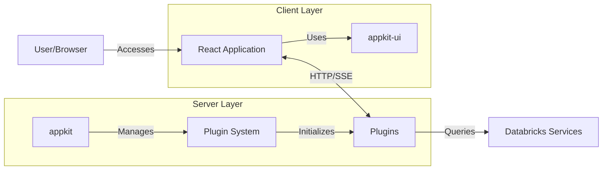

# Architecture

AppKit follows a plugin-based architecture designed for building production-ready Databricks applications. This document provides a high-level overview of the system components and their interactions.

## High-level architecture

## Core components

AppKit is organized into two main packages:

### @databricks/appkit

The backend SDK that provides the plugin architecture and core functionality. It includes:

- Plugin system with lifecycle management
- Built-in server and analytics plugins
- Telemetry and observability features
- Cache management and streaming capabilities
- Type generation for SQL queries

See the [Plugins](./plugins.md) and [API Reference](./api/appkit/) documentation for detailed information.

### @databricks/appkit-ui

A React UI library with pre-built components optimized for data applications:

- React hooks for query execution and streaming
- UI components based on Radix UI and Tailwind
- Data visualization components
- Type-safe integration with backend queries

See the [API Reference](./api/appkit-ui/) for component documentation.

## Application layers

### Client layer

The React frontend layer that optionally uses `@databricks/appkit-ui` components:
- Renders UI components and visualizations
- Manages client state and user interactions
- Consumes backend APIs via HTTP and SSE
- Provides type-safe query execution hooks

### Server layer

The Node.js backend layer built with `@databricks/appkit`:
- Serves the React application (dev and production modes)
- Executes SQL queries against Databricks SQL Warehouses
- Handles authentication and authorization
- Provides caching, retry logic, and error handling
- Exposes REST APIs and SSE endpoints

### Data layer

Integration with Databricks services:
- **SQL Warehouses**: Execute analytical queries with Arrow or JSON format
- **Lakebase**: Access data from Lakebase

## See also

- [Plugins](./plugins.md): Deep dive into the plugin system
- [API Reference](./api/): Complete API documentation
- [Development](./development/): Explore development workflows
- [Core Principles](./core-principles.md): Learn about AppKit's design philosophy
