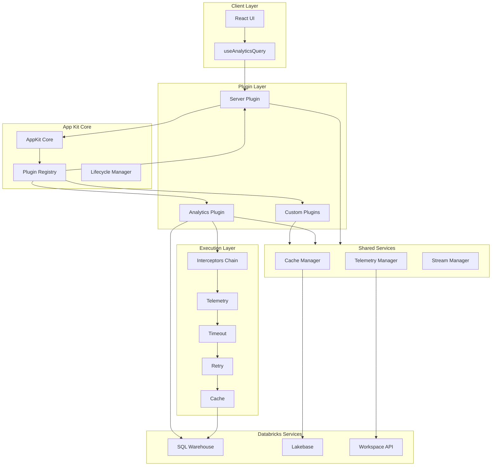
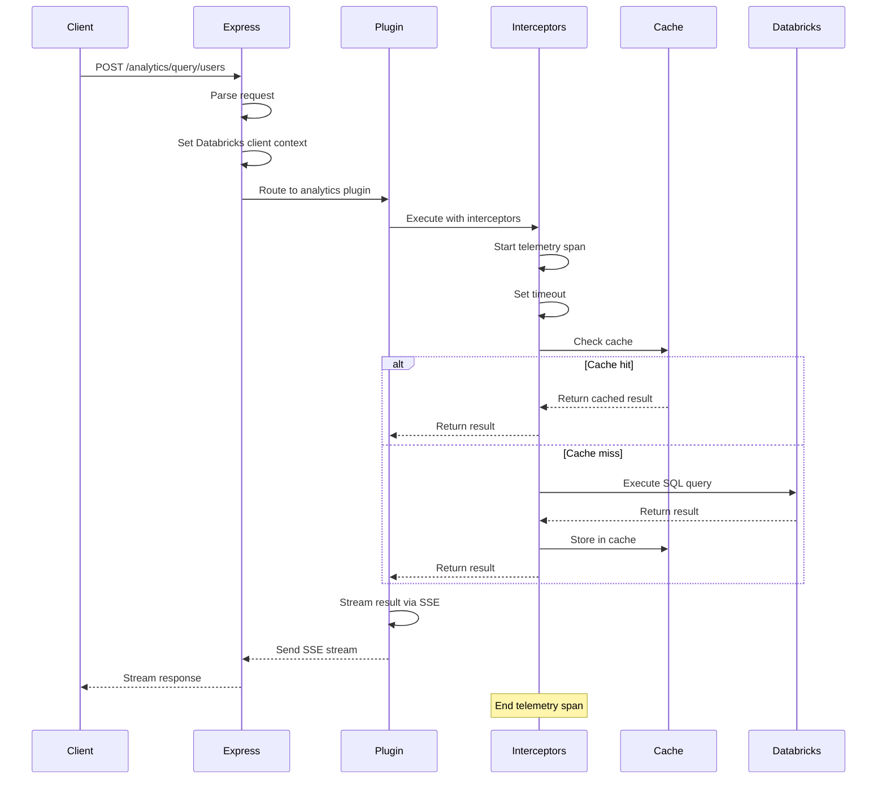

# Architecture

App Kit is built on a layered, plugin-based architecture that provides modularity, extensibility, and production-ready capabilities out of the box.

## Overview

The SDK follows a plugin-centric design where the core orchestrates plugin lifecycle and provides shared services. Each plugin extends functionality while maintaining clean separation of concerns.



## Core Components

### AppKit Core

The central orchestrator that manages the plugin lifecycle and provides shared infrastructure.

**Key Responsibilities:**
- Plugin registration and initialization
- Lifecycle management (setup, ready, shutdown)
- Global configuration (cache, telemetry)
- Singleton instance management

**Plugin Phases:**
1. **Core**: First to initialize (reserved for future use)
2. **Normal**: Standard plugins (default phase)
3. **Deferred**: Last to initialize, has access to other plugin instances

```typescript
// Example: Plugin registration
const AppKit = await createApp({
  plugins: [
    server(),      // Deferred phase - needs other plugins
    analytics(),   // Normal phase
  ],
  cache: {
    enabled: true,
    ttl: 3600,
  },
  telemetry: {
    traces: true,
    metrics: true,
  },
});
```

### Plugin System

Base `Plugin` class provides common functionality for all plugins.

**Built-in Services:**
- `cache`: CacheManager instance for caching results
- `telemetry`: ITelemetry instance for observability
- `streamManager`: StreamManager for SSE streaming
- `app`: AppManager for app metadata and queries

**Plugin Lifecycle:**
1. **Construction**: Plugin instantiated with config
2. **Validation**: Environment variables validated
3. **Setup**: Async initialization (override `setup()`)
4. **Ready**: Plugin available for use
5. **Shutdown**: Cleanup (override `shutdown()`)

### Server Layer

The Server Plugin provides HTTP server capabilities with multiple modes.

**Components:**
- **Express Server**: REST API and plugin routes
- **Vite Dev Server**: Hot module reload for development
- **Static Server**: Production static file serving
- **Remote Tunnel**: WebSocket bridge to deployed backends

**Configuration:**
```typescript
server({
  port: 8000,
  host: "0.0.0.0",
  autoStart: true,  // Start server immediately
})
```

### Data Layer

Handles data access and query execution.

**SQL Warehouse Connector:**
- Executes SQL queries via Databricks SQL Warehouse
- Supports parameterized queries with type safety
- Returns JSON or Arrow format results

**Lakebase Connector:**
- Persistent cache storage using Databricks Lakebase
- Automatic fallback to in-memory cache
- Health checks and connection management

**Query Management:**
- File-based queries in `config/queries/`
- Automatic type generation via `appKitTypesPlugin`
- Parameter substitution with SQL helpers

### Execution Layer

Interceptor chain wraps plugin execution with cross-cutting concerns.

**Interceptor Order** (outermost to innermost):
1. **Telemetry**: Traces, spans, and metrics
2. **Timeout**: Abort long-running operations
3. **Retry**: Automatic retry with exponential backoff
4. **Cache**: Result caching with deduplication

```typescript
// Interceptors are configured per execution
const result = await this.execute(
  () => fetchData(),
  {
    default: {
      timeout: 30000,
      retry: { enabled: true, attempts: 3 },
      cache: { enabled: true, cacheKey: ["data", id] },
    },
  },
  userKey,
);
```

### Observability

OpenTelemetry integration provides production-grade observability.

**Telemetry Components:**
- **Traces**: Distributed tracing with spans
- **Metrics**: Counters, histograms for performance
- **Logs**: Structured logging with context

**Automatic Instrumentation:**
- HTTP requests and responses
- Express middleware and routes
- Cache hits and misses
- Query execution timing

## Request Flow



**Flow Details:**

1. **Request Reception**: Express receives HTTP request
2. **Context Setup**: Databricks client set in request context
3. **Route Matching**: Request routed to plugin handler
4. **Interceptor Chain**: Execution wrapped with interceptors
5. **Cache Check**: Look for cached result
6. **Query Execution**: Execute against Databricks (if cache miss)
7. **Result Streaming**: Stream response via SSE
8. **Telemetry**: Record traces, metrics, logs

## Packages

### @databricks/app-kit

Core SDK package providing the plugin architecture and built-in plugins.

**Key Exports:**
- `createApp`: Initialize App Kit with plugins
- `server`: Server plugin factory
- `analytics`: Analytics plugin factory
- `Plugin`: Base class for custom plugins
- `toPlugin`: Helper for type-safe plugin creation
- `sql`: SQL type helpers (date, string, number, etc.)
- `CacheManager`: Cache management singleton

### @databricks/app-kit-ui

React components and hooks for building UIs.

**Key Exports:**
- `useAnalyticsQuery`: React hook for SSE queries
- Chart components: `AreaChart`, `BarChart`, `LineChart`, `PieChart`, etc.
- UI primitives: Forms, buttons, tables, and more
- `QueryRegistry`: Type-safe query interface (via module augmentation)

## Extension Points

App Kit provides multiple ways to extend functionality:

1. **Custom Plugins**: Extend `Plugin` class for new capabilities
2. **Route Injection**: Add custom routes via `injectRoutes()`
3. **Interceptors**: Add custom execution interceptors
4. **Cache Storage**: Implement custom cache backends
5. **Telemetry Providers**: Custom observability integrations
