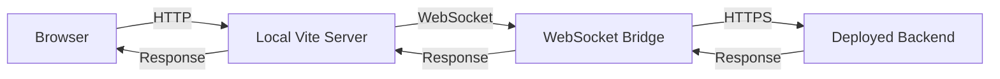

# Development

App Kit provides multiple development workflows to suit different needs: local development with hot reload, AI-assisted development with MCP, and remote tunneling to deployed backends.

## Prerequisites

### Databricks CLI

Install the Databricks CLI for deployment and remote development:

```bash
# macOS
brew install databricks/tap/databricks

# Linux/Windows
curl -fsSL https://raw.githubusercontent.com/databricks/setup-cli/main/install.sh | sh
```

See the [official installation guide](https://docs.databricks.com/dev-tools/cli/install.html) for detailed instructions.

### Authentication

Configure authentication using a Databricks profile or personal access token (PAT).

**Using a Profile:**

```bash
databricks configure --profile my-workspace
```

**Using Environment Variables:**

```bash
export DATABRICKS_HOST="https://your-workspace.cloud.databricks.com"
export DATABRICKS_TOKEN="your-personal-access-token"
```

See [Databricks authentication documentation](https://docs.databricks.com/dev-tools/auth/index.html) for more options.

## Local Development

Local development provides the fastest iteration cycle with hot reload for both UI and backend code.

### Starting from the Template

Use the `clean-app` template as a starting point:

```bash
# Copy the template
cp -r apps/clean-app my-app
cd my-app

# Install dependencies
pnpm install

# Create .env file
cat > .env << EOF
DATABRICKS_HOST=https://your-workspace.cloud.databricks.com
DATABRICKS_WAREHOUSE_ID=your-warehouse-id
EOF
```

### Project Structure

```
my-app/
├── server.ts              # Backend entry point
├── src/                   # Frontend source
│   ├── App.tsx           # Main React component
│   ├── main.tsx          # React entry point
│   └── ...
├── config/
│   └── queries/          # SQL query files
│       └── example.sql
├── public/               # Static assets
├── package.json
├── vite.config.ts
└── .env                  # Environment variables
```

### Running the Development Server

Start the development server with hot reload:

```bash
pnpm dev
```

This command:
- Starts the backend server with `tsx watch`
- Launches Vite dev server for the frontend
- Enables hot module reload for both UI and backend
- Watches for changes in query files

Your app will be available at `http://localhost:8000`.

### Working with SQL Queries

Store SQL queries in the `config/queries/` directory:

```sql
-- config/queries/users.sql
SELECT 
  id,
  name,
  email,
  created_at
FROM main.default.users
WHERE created_at > :startDate
ORDER BY created_at DESC;
```

### Type Generation

Enable automatic type generation for type-safe queries.

**Configure Vite Plugin:**

```typescript
// vite.config.ts
import { defineConfig } from "vite";
import react from "@vitejs/plugin-react";
import { appKitTypesPlugin } from "@databricks/app-kit";

export default defineConfig({
  plugins: [
    react(),
    appKitTypesPlugin({
      queriesDir: "./config/queries",
      outputFile: "./src/appKitTypes.d.ts",
    }),
  ],
});
```

**Module Augmentation:**

The plugin generates type definitions that augment the `QueryRegistry`:

```typescript
// src/appKitTypes.d.ts (auto-generated)
declare module "@databricks/app-kit-ui/react" {
  interface QueryRegistry {
    users: {
      name: "users";
      parameters: { startDate: string };
      result: Array<{
        id: string;
        name: string;
        email: string;
        created_at: string;
      }>;
    };
  }
}
```

**Type-Safe Usage:**

```typescript
import { useAnalyticsQuery } from "@databricks/app-kit-ui/react";

function UsersList() {
  // Fully typed based on QueryRegistry
  const { data, loading, error } = useAnalyticsQuery({
    queryKey: "users", // Autocomplete available!
    parameters: {
      startDate: "2024-01-01", // Type-checked!
    },
  });

  // data is typed as Array<{ id: string, name: string, ... }>
  return (
    <ul>
      {data?.map((user) => (
        <li key={user.id}>{user.name}</li>
      ))}
    </ul>
  );
}
```

### Environment Variables

Create a `.env` file in your project root:

```bash
# Required for analytics plugin
DATABRICKS_HOST=https://your-workspace.cloud.databricks.com
DATABRICKS_WAREHOUSE_ID=your-warehouse-id

# Optional: Authentication (if not using profile)
DATABRICKS_TOKEN=your-personal-access-token

# Optional: Server configuration
DATABRICKS_APP_PORT=8000
FLASK_RUN_HOST=0.0.0.0

# Optional: Development mode
NODE_ENV=development
```

## AI-Assisted Development

App Kit integrates with AI coding assistants through the Model Context Protocol (MCP).

### Installing MCP Server

Install the Databricks MCP server:

```bash
databricks experimental apps-mcp install
```

This command:
- Installs the MCP server binary
- Guides you through configuration for Claude Desktop, Cursor, or other MCP clients
- Sets up authentication

### MCP Capabilities

The MCP server provides AI assistants with tools to:

- **Data Exploration**: Query catalogs, schemas, and tables
- **SQL Execution**: Run SQL queries and inspect results
- **CLI Operations**: Execute Databricks CLI commands
- **Workspace Resources**: Discover and interact with workspace resources

### Configuration Example

For Claude Desktop, the installer adds configuration to `~/Library/Application Support/Claude/claude_desktop_config.json`:

```json
{
  "mcpServers": {
    "databricks": {
      "command": "databricks",
      "args": ["experimental", "apps-mcp", "--warehouse-id", "your-warehouse-id"]
    }
  }
}
```

### Using with AI Assistants

Once configured, AI assistants can:

```
You: "Show me the schema of the users table in main.default"

AI: [Uses MCP to query table schema]
    The users table has the following columns:
    - id: BIGINT
    - name: STRING
    - email: STRING
    - created_at: TIMESTAMP
```

```
You: "Create a query to find users created in the last 7 days"

AI: [Uses MCP to understand schema and create query]
    I'll create a query file for you:
    [Creates config/queries/recent_users.sql with appropriate query]
```

## Remote Tunneling

Remote tunneling allows you to develop against a deployed backend while keeping your UI local.

### When to Use Remote Tunneling

Use remote tunneling when:
- Testing against production data
- Debugging deployed backend code
- Developing UI without running backend locally
- Collaborating with team members on the same backend

### Starting Remote Development

```bash
databricks apps dev-remote --app-name my-app
```

**Options:**

```bash
databricks apps dev-remote \
  --app-name my-app \
  --client-path ./client \
  --port 5173
```

### How It Works

Remote tunneling creates a WebSocket bridge between your local Vite dev server and the deployed backend:



### Connection Approval

When you start remote tunneling, you'll see a prompt in the terminal:

```
Remote tunnel connection request from:
  User: your-email@company.com
  Client: dev-remote-cli
  IP: 203.0.113.42

Approve this connection? [y/N]:
```

Type `y` and press Enter to approve the connection.

### What Gets Hot Reloaded

With remote tunneling:

- ✅ **UI Changes**: Instant hot reload
- ✅ **Query Files**: Changes to `config/queries/` are picked up
- ❌ **Backend Code**: Requires redeployment

### Stopping Remote Development

Press `Ctrl+C` in the terminal to stop the remote tunnel.

## Development Tips

### Hot Reload Best Practices

1. **Keep Backend Light**: Heavy backend operations slow down reload
2. **Use Query Files**: Easier to iterate than inline SQL
3. **Enable Source Maps**: Better debugging experience
4. **Watch for Memory Leaks**: Long-running dev sessions can accumulate memory

### Debugging

**Backend Debugging:**

```bash
# Start with Node.js inspector
pnpm dev:inspect

# Then attach your debugger to localhost:9229
```

**Frontend Debugging:**

Use browser DevTools with React DevTools extension for best experience.

### Performance Optimization

**Development:**
- Use `format: "JSON"` for smaller datasets during development
- Enable caching to avoid repeated queries
- Use query parameters to limit result sets

**Production:**
- Use `format: "ARROW"` for large datasets
- Configure appropriate cache TTLs
- Enable telemetry for performance monitoring

### Common Issues

**Port Already in Use:**

```bash
# Find and kill process using port 8000
lsof -ti:8000 | xargs kill -9
```

**Warehouse Not Found:**

Verify your `DATABRICKS_WAREHOUSE_ID` is correct:

```bash
databricks warehouses list
```

**Authentication Errors:**

Check your credentials:

```bash
databricks auth describe
```

## Next Steps

- **[Deployment](./deployment)**: Deploy your application to Databricks
- **[Architecture](./core-concepts/architecture)**: Understand the system architecture
- **[Plugins](./core-concepts/plugins)**: Create custom plugins
