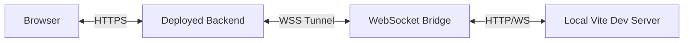

import Prerequisites from './_prerequisites_app.mdx';

# Remote Bridge

<Prerequisites />

Remote bridge allows you to develop against a deployed backend while keeping your UI and queries local. This is useful for testing against production data or debugging deployed backend code without redeploying your app.

## When to Use Remote Bridge

Use remote bridge when:
- Testing against production data
- Debugging deployed backend code
- Developing UI without running backend locally
- Collaborating with team members on the same backend

## Starting and Stopping the Remote Bridge

To start the remote bridge, run the following command:

```bash
databricks apps dev-remote --app-name my-app --client-path ./client
```

The command will:

1. Start a local Vite development server
2. Establish a WebSocket bridge to your deployed app
3. Provide two URLs:

   - **App URL**: Direct link for your own use (`<app-url>?dev=true`)
   - **Shareable URL**: Link with tunnel ID for sharing with team members (`<app-url>?dev=<tunnelId>`)


:::note

For all available options, run:
```bash
databricks apps dev-remote --help
```
:::

To stop the remote bridge, press `Ctrl+C` in the terminal.

## Connection Approval

When you start remote bridge, every time you open the URL in your browser from a new device, you'll be prompted to approve the connection.

You can provide the URL to your team members to allow them to see the app in their browser. You will still need to approve the connection from your side.

## How It Works

Remote bridge creates a WebSocket bridge between your local Vite dev server and the deployed backend, allowing you to develop UI locally while using the deployed backend.



### Details

- The **Browser** connects to the deployed app backend with `?dev=true` or `?dev=<tunnelId>` query parameter
- The **Deployed Backend** proxies UI requests through a WebSocket tunnel (`/dev-tunnel`) to your local machine
- The **WebSocket Bridge** (running locally) receives fetch requests and file read requests from the backend
- The **Local Vite Dev Server** serves the UI files and provides hot module replacement (HMR)
- The bridge sends responses back through the WebSocket to the backend, which serves them to the browser

### What Gets Hot-Reloaded

With remote bridge you get instant hot-reload for:

- **UI Changes** - Any changes to your React/TypeScript/CSS files in the `client/` directory
- **Query Files** - SQL files in the `config/queries/` directory (`.sql` files only)

Backend code is **not** hot-reloaded. You need to redeploy your app to see changes in the backend code.
